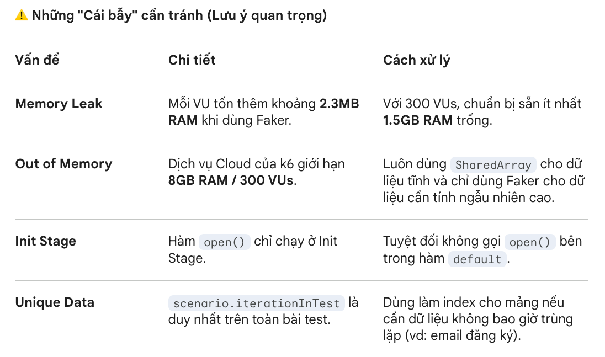

### 📊 Bài 2.6: Data-Driven Testing (Tham số hóa dữ liệu)

Mục tiêu bài học: Biến các giá trị test tĩnh thành các tham số có thể tái sử dụng. Nắm vững kỹ thuật sử dụng SharedArray để tối ưu bộ nhớ và các chiến thuật lấy dữ liệu (Unique, Random, Round-robin) để mô phỏng người dùng thật.

**🧠1. Tại sao phải tham số hóa dữ liệu?**
Trong kiểm thử hiệu năng, việc sử dụng cùng một bộ dữ liệu cho hàng ngàn request sẽ dẫn đến:

**Server-side Caching:** Server trả về kết quả từ bộ nhớ đệm, không phản ánh đúng hiệu năng thực tế của Database.

**Thiếu thực tế:** Người dùng thật không bao giờ đăng nhập cùng một tài khoản trên 1000 thiết bị cùng lúc.

**Tham số hóa (Parameterization)** giúp bài test khách quan hơn và vượt qua được các lớp cache của server.

**🚀 2. "Vị cứu tinh" SharedArray**
Một đặc điểm cực kỳ quan trọng của k6: **Mỗi VU là một máy ảo JavaScript (JS VM) độc lập.**

**Vấn đề:** Nếu bạn load file data.json 10MB cho 1000 VUs theo cách thông thường, k6 sẽ tiêu tốn 10GB RAM. Hệ thống sẽ báo lỗi Out of Memory và sập nguồn.

**Giải pháp:** SharedArray chỉ load và parse dữ liệu đúng 1 lần, sau đó chia sẻ vùng nhớ đó cho tất cả các VUs.

**📂 3. Đọc dữ liệu từ File**

**A. Từ file JSON**

JSON là định dạng "con đẻ" của k6, cực kỳ dễ sử dụng.

```javascipt
import { SharedArray } from 'k6/data';

const data = new SharedArray('danh sach user', function () {
  // open() nạp file, JSON.parse chuyển thành object
  return JSON.parse(open('./data.json')).users;
});

export default function () {
  const user = data[0]; // Lấy phần tử đầu tiên
  console.log(`Đang test với user: ${user.username}`);
}
```

**B. Từ file CSV (Dùng Papa Parse)**

k6 không đọc được CSV trực tiếp, bạn cần dùng thư viện Papa Parse từ jslib.

```javascipt
import { SharedArray } from 'k6/data';
import papaparse from 'https://jslib.k6.io/papaparse/5.1.1/index.js';

const csvData = new SharedArray('data tu csv', function () {
  return papaparse.parse(open('./data.csv'), { header: true }).data;
});

export default function () {
  const row = csvData[0];
  console.log(`Dữ liệu cột Email: ${row.email}`);
}
```

**🎯 4. Các chiến thuật chọn dữ liệu (Data Selection)**

Tùy vào kịch bản test, bạn sẽ có cách lấy dữ liệu từ SharedArray khác nhau:

**🎲 Chiến thuật 1: Ngẫu nhiên (Random)**

Dùng khi bạn không quan tâm user nào đang chạy, miễn là dữ liệu đa dạng.

```bash
const randomUser = csvData[Math.floor(Math.random() * csvData.length)];
```

**🆔 Chiến thuật 2: Duy nhất (Unique)**

Dùng cho kịch bản Đăng ký (mỗi email chỉ dùng 1 lần). Ta dùng `scenario.iterationInTest.`

```javascipt
import { scenario } from 'k6/execution';

export default function () {
  // Lấy dòng dữ liệu tương ứng với số thứ tự vòng lặp của toàn bài test
  const user = data[scenario.iterationInTest];
  console.log(`User này là duy nhất: ${user.email}`);
}
```

**🔄 Chiến thuật 3: Xoay vòng (Round-Robin)**

Dùng khi số lượng dữ liệu ít hơn số lượng VUs, đảm bảo các VU chia nhau dùng hết data và quay lại từ đầu.

```javascipt
import { scenario } from 'k6/execution';

export default function () {
  const vus = 100;
  const user = data[scenario.iterationInTest % vus];
}
```

**👤 Chiến thuật 4: Theo từng VU (Per-VU)**

VU số 1 luôn dùng tài khoản 1, VU số 2 luôn dùng tài khoản 2.

```javascipt
import { vu } from 'k6/execution';

export default function () {
  const user = data[vu.idInTest - 1]; // vu.idInTest bắt đầu từ 1
}
```

### ✨ 5. Tạo dữ liệu giả với Faker.js

Đôi khi bạn không muốn chuẩn bị file CSV khổng lồ, bạn có thể tạo dữ liệu "như thật" ngay khi đang chạy test bằng thư viện Faker.

Ứng dụng: Tạo tên người dùng, số điện thoại, địa chỉ, số thẻ tín dụng ngẫu nhiên.

**✨ 5.1. Kịch bản thực chiến: Acme Corp Newsletter**

Hãy tưởng tượng công ty Acme Corp sắp ra mắt form đăng ký nhận tin (Newsletter) vào dịp Black Friday. Họ dự kiến có hàng trăm lượt đăng ký mỗi giây. Để test tải thật nhất, chúng ta không thể dùng một email `test@gmail.com` cho mọi request vì server có thể chặn hoặc cache dữ liệu

**Giải pháp:** Dùng Faker.js để biến mỗi VU thành một "người dùng thật" với đầy đủ thông tin cá nhân.

**⚙️ 5.2. Kỹ thuật Bundling (Điều kiện cần)**

Vì k6 chạy trên máy ảo Goja (Go-based JS VM) chứ không phải môi trường Node.js truyền thống, bạn không thể chỉ npm install rồi chạy ngay.

**Giải pháp:** Sử dụng Webpack và Babel để đóng gói (bundle) thư viện Faker thành một file mà k6 có thể đọc được.

**Mẹo tiết kiệm RAM:** Chỉ nên import các locale cần thiết (Ví dụ: faker/locale/en_US) thay vì toàn bộ thư viện để tránh làm script bị nặng.

**💻 5.3. Code mẫu: Subscriber Service (subscriber.js)**

```bash
import * as faker from 'faker/locale/en_US';

export const generateSubscriber = () => ({
    // Thêm prefix SUBSCRIPTION_TEST để dễ dàng dọn dẹp Database sau khi test
    name: `SUBSCRIPTION_TEST - ${faker.name.firstName()} ${faker.name.lastName()}`,
    title: faker.name.jobTitle(),
    company: faker.company.companyName(),
    email: faker.internet.email(),
    country: faker.address.country()
});
```

**📊 5.4. Tích hợp Metrics & Thresholds với Faker**

```bash
import { sleep } from 'k6';
import http from 'k6/http';
import { Rate } from 'k6/metrics';
import { generateSubscriber } from './subscriber';

const submitFailRate = new Rate('failed_submits');

export const options = {
  vus: 300,
  duration: '10s',
  thresholds: {
    'failed_submits': ['rate<0.1'],      // Tỉ lệ lỗi dưới 10%
    'http_req_duration': ['p(95)<400'], // 95% request phản hồi dưới 400ms
  }
};

export default function() {
  const person = generateSubscriber();
  const payload = JSON.stringify(person);

  const res = http.post('https://httpbin.test.loadimpact.com/anything', payload);

  submitFailRate.add(res.status !== 200);
  sleep(1);
}
```



### 📚 Nguồn tham khảo (References)

**🔹 Tài liệu k6 chính thức**
k6 Data Parameterization Guide - Tổng quan về tham số hóa dữ liệu.
https://grafana.com/docs/k6/latest/examples/data-parameterization/
SharedArray API Documentation - Kỹ thuật tối ưu bộ nhớ.
https://grafana.com/docs/k6/latest/javascript-api/k6-data/sharedarray/

k6 Execution Context - Tìm hiểu về vu.idInTest và scenario.iterationInTest.
https://grafana.com/docs/k6/latest/javascript-api/k6-execution/
**🔹 Bài viết chuyên sâu & Thư viện**
Performance Testing with Generated Data (k6 Blog) - Bài viết gốc về Acme Corp và Faker.js.
https://dev.to/k6/performance-testing-with-generated-data-using-k6-and-faker-2e
Load Testing with Faker.js and CSV Files - Cách kết hợp linh hoạt giữa file tĩnh và dữ liệu động.
Papa Parse Library - Thư viện parse CSV tiêu chuẩn cho k6.
https://jslib.k6.io/papaparse/5.1.1/index.js
